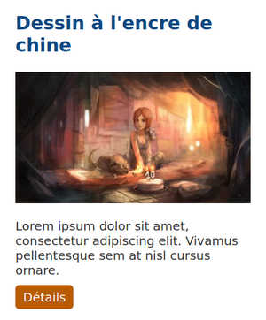
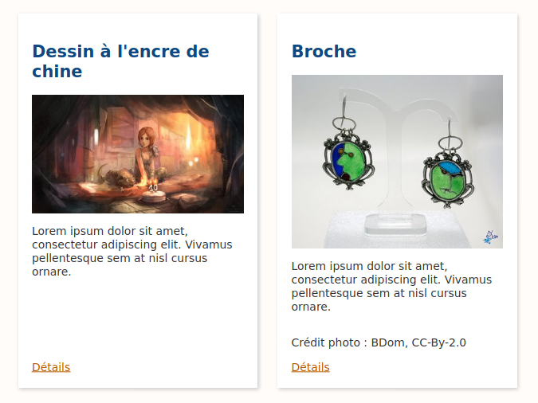

# Énoncé TP2

Télécharger le [dossier du TP pour le TP2](https://gitlab.com/n7-fullstack/cours/tp-css-site-artisanat/-/releases/tp2-v1.0)

## Session 1 : mise en forme

### Sélecteurs avancés

* Positionner l'image d'un artisan alternativement à droite ou à gauche du texte.

### Styles CSS3 : blocs des produits

* Remplacer la bordure par une ombre
* Arrondir les coins des blocs
* **bonus** : changer le thème du lien détail pour avoir un bouton (vous devrez adapter le HTML)

    

### Police de caractères

Appliquer la police Roboto Slab pour les titres :
    * en utilisant Google fonts
    * **bonus** : en la téléchargeant sur [FontSquirrel](https://www.fontsquirrel.com/fonts/roboto-slab?q%5Bterm%5D=robot&q%5Bsearch_check%5D=Y))

### **Bonus** : transition et translations

* Ajouter une transition de 500ms sur la couleur des liens (et la couleur de fond)

## Session 2 : mise en page

### Flexbox

Aligner le lien détail toujours en bas au centre de chaque bloc

Pour cela, vous devrez modifier le HTML

### Grid layout

Utiliser Grid layout pour la disposition générale de la page. Quelles conclusions vous en tirez ?

### Responsive

Seulement pour les tablettes et PC :

* Dans la page produit, afficher 2 blocs produits par ligne
* Dans la page artisans, appliquer le positionnement des images

